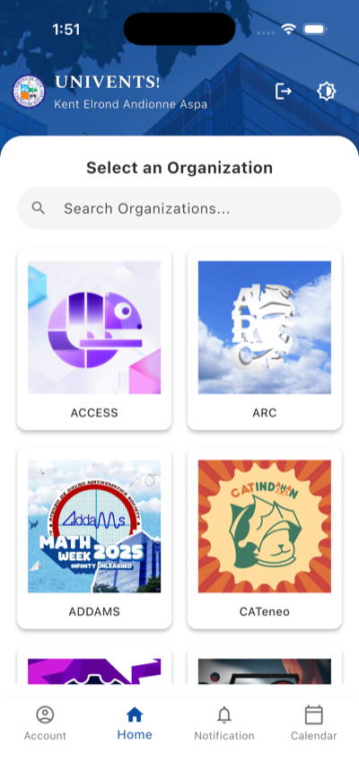
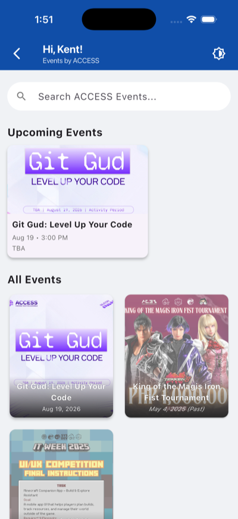
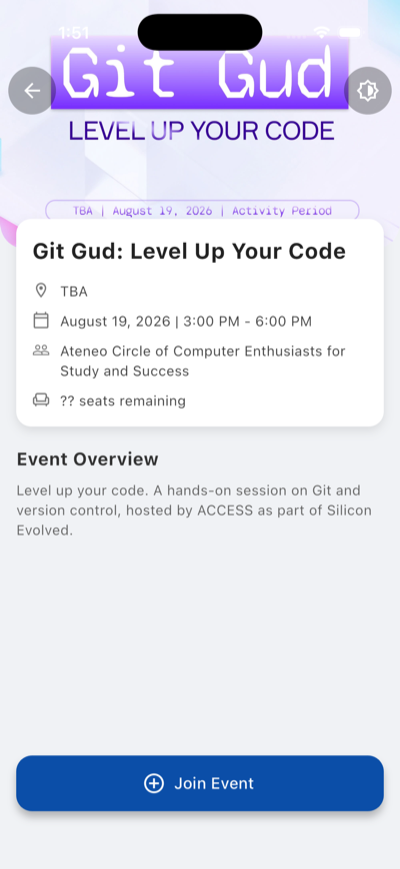

# UNIVENTS

A Flutter app for discovering and joining university organization events at
Ateneo de Davao University. Students sign in with their university account,
browse student organizations, and register for events.

Built with Flutter and Firebase (Authentication + Cloud Firestore).

Developed as the final project for **IT Elective 5 (Multi-Platform App
Development)**, 2nd Semester A.Y. 2024–2025, Ateneo de Davao University.

---

## Screenshots

| Splash | Organizations | Events | Event detail |
|---|---|---|---|
|  |  |  |  |

## Features

- **Domain-restricted authentication** — Google Sign-In and email/password, both
  limited to verified `@addu.edu.ph` addresses. The restriction is enforced
  server-side in Firestore rules, not only in the client.
- **Organization directory** — live-updating list of student organizations with
  debounced search across names and acronyms.
- **Event browsing** — per-organization upcoming and full event listings, with
  date parsing and past/upcoming visual states.
- **Event registration** — join and leave events; attendance is written to a
  per-user subcollection that only that user can read or modify.

## Tech stack

| Layer | Choice |
|---|---|
| Framework | Flutter (Dart SDK `^3.7.2`) |
| Auth | `firebase_auth` 6.5.7, `google_sign_in` 7.2.0 |
| Database | `cloud_firestore` 6.8.0 |
| Core | `firebase_core` 4.13.0 |
| Configuration | `flutter_dotenv` |
| Utilities | `intl`, `smooth_page_indicator` |

Targets Android, iOS, macOS, and web from one codebase.

## Project structure

```
Univents_Mobile/                        Flutter client (this app)
├── lib/
│   ├── main.dart                       App entry, Firebase + Google Sign-In init
│   ├── splash_screen.dart              Session restore and eligibility gate
│   ├── login_screen.dart               Email/password + Google Sign-In
│   ├── home_screen.dart                Organization directory with search
│   ├── organization_events_screen.dart Events for one organization
│   ├── event_details_screen.dart       Event detail, join/leave
│   ├── google_sign_in_config.dart      Single source of Google Sign-In config
│   ├── app_config.dart                 Runtime config from .env, with fallbacks
│   └── firebase_options.dart           Generated by `flutterfire configure`
├── .env.example                        Configuration template (copy to .env)
├── firestore.rules                     Server-side access control
└── firebase.json                       Firebase CLI configuration

docs/
├── SECURITY.md                         Access control model and rationale
└── screenshots/                        Images used above
```

The mobile client is one half of the system. Organizations and events are
administered through a separate web application, which is why this app treats
those collections as read-only and `firestore.rules` denies client writes to
them.

## Data model

| Collection | Purpose | Client access |
|---|---|---|
| `users/{uid}` | Profile and role | Owner read; constrained create/update |
| `organizations/{id}` | Student organizations | Read-only |
| `events/{id}` | Events, linked to an organization | Read-only |
| `events/{id}/attendees/{uid}` | Event registrations | Owner only |

Organization and event records are curated outside the mobile app; it never
writes to those collections.

## Security

Access control lives in [`firestore.rules`](Univents_Mobile/firestore.rules)
and is documented in [`docs/SECURITY.md`](docs/SECURITY.md). The short version:

- Firebase API keys are public client identifiers, not secrets — they ship in
  every app binary. Firestore rules, not key secrecy, are what protect the data.
- Client-side checks are treated as UX conveniences and re-asserted server-side.
- Email verification is required, because Firebase's sign-up endpoint does not
  prove ownership of an address.
- Every collection is default-deny; access is granted deliberately.

## Getting started

**Prerequisites**

- Flutter 3.47 or newer
- Xcode (iOS/macOS) and/or Android Studio with the Android SDK
- CocoaPods, for iOS/macOS builds

**Setup**

```bash
git clone <repository-url>
cd flutterelectivefinal/Univents_Mobile
cp .env.example .env
flutter pub get
flutter run
```

`lib/firebase_options.dart` is committed, so the app builds against the existing
Firebase project without extra configuration. The `cp` step is optional — if
`.env` is absent the app falls back to the defaults compiled into
`lib/app_config.dart`.

**Configuration**

Environment-dependent values live in `.env`, loaded at startup by
`lib/app_config.dart`:

| Key | Purpose |
|---|---|
| `AUTH_EMAIL_DOMAIN` | Email domain permitted to sign in |
| `GOOGLE_SERVER_CLIENT_ID` | OAuth web client ID used by Google Sign-In on Android |

`.env` is gitignored; `.env.example` is the committed template.

> `.env` is **not** a secret store. Flutter bundles it into the app as an asset,
> so anything in it ships inside the binary and can be extracted. Every value
> there is public by nature. Secrets belong on a server — a Cloud Function using
> the Admin SDK — never in a client app. The purpose here is keeping
> environment-dependent configuration in one declared place.
>
> Note also that changing `AUTH_EMAIL_DOMAIN` does not change who can read data.
> The binding restriction is the matching rule in `firestore.rules`.

**Pointing it at your own Firebase project**

```bash
dart pub global activate flutterfire_cli
flutterfire configure
```

This regenerates `firebase_options.dart` and registers each platform. If you
change the iOS bundle ID, update the Google Sign-In URL scheme in
`ios/Runner/Info.plist` to the reversed client ID of the new OAuth client —
sign-in cannot return to the app without it.

**Deploying the security rules**

```bash
firebase deploy --only firestore:rules --project <your-project-id>
```

Rules are inert until deployed. A project left in test mode is fully open
regardless of what this repository contains.

## Known limitations

- `test/widget_test.dart` is unmodified Flutter boilerplate (a counter test for
  an app with no counter) and does not pass. The project has no test coverage.
- Android release builds are signed with the debug keystore; a real signing
  config is required before distribution.
- The `role` field exists on user documents but no admin functionality is built
  on it yet. Roles are pinned to `student` client-side and can only be changed
  with the Admin SDK.
- Attendee documents are readable only by their owner, so attendee lists and
  counts are not available to the UI. Adding them needs a counter maintained by
  a Cloud Function.
- Organization logos are hotlinked from external hosts, so a dead link renders a
  placeholder rather than an image.

## Author

**Kent Elrond Andionne Aspa** — sole developer of the Flutter mobile
application. Designed and implemented the app, modelled and populated the
Firestore database, authored the security rules, and produced the organization
and event content used throughout.

Submitted for IT Elective 5 (Multi-Platform App Development), 2nd Semester
A.Y. 2024–2025, Ateneo de Davao University.

## License

Released under the [MIT License](LICENSE).
